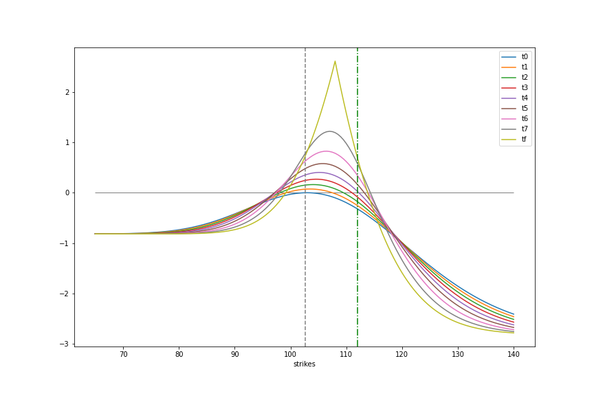

# Finx Option Pricer
Price and visualize options with fine grained option params.

I created the tool out a desire to see how the PnL changes for non-standard combination options. For example, Long /CL Diagonal where the front 8DTE position has IV of 43% and back 14DTE position has IV of 32%.


## Example
Here's a realistic example using options on Crude Futures

```
import matplotlib.pyplot as plt
from finx_option_pricer.option import Option
from finx_option_pricer.option_plot import OptionsPlot, OptionPosition

spot_range = [65, 140]

oil_price = 102.67

# long 14d put @ 110
op1 = OptionPosition(
    quantity=1,
    option=Option(S=oil_price, K=110, T=14/252, r=0.0, sigma=0.65, option_type='p'))

# short 8d call @ 108
op2 = OptionPosition(
    quantity=-1,
    option=Option(S=oil_price, K=108, T=8/252, r=0.0, sigma=0.65, option_type='p'))

op_plot = OptionsPlot(option_positions=[op1, op2], spot_range=spot_range)

# increment 10 days, 1 day at a time
df = op_plot.gen_value_df_timeincrementing(8, 1)

# arbitrary transformations to graph the data
df.set_index("strikes", inplace=True)
columns = [f"t{i}" for i, _ in enumerate(df.columns)]
columns[-1] = "tf"
df.columns = columns

df.plot(figsize=(12, 8))
plt.hlines(0, spot_range[0], spot_range[1], color="black", linewidth=0.5)
plt.axvline(x=oil_price, color="grey", linestyle="--")
plt.axvline(x=112, color='green', linestyle="-.")
```


## Install
Todo

## Dev
```
git clone https://github.com/westonplatter/finx-option-pricer
cd finx-option-pricer
make env.update
# make changes
```
## Test
There are currently few to no tests.
```
make test
```

## License
Per the BSD-3 License, you're solely responsible for decisions you make with this code.

BSD-3. See LICENSE file.
